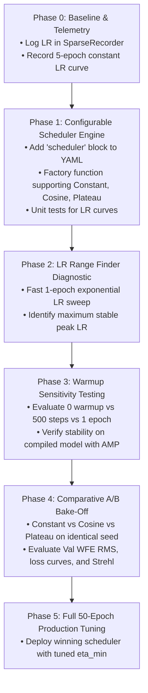

# Learning Rate Scheduler Phased Implementation and Optimization Plan

## Overview
Currently, [`train.py`](file:///home/u7/warrenbfoster/git/nn_WFS/train.py#L541-L545) uses a fixed learning rate via `ConstantLR(optimizer, factor=1.0)` with a base LR of $3.0 \times 10^{-4}$. The original cosine annealing schedule (`_lr_lambda`) was commented out during early development.

To maximize final optical wavefront reconstruction accuracy (minimizing RMS wavefront error $\sigma_{\text{WFE}}$ and maximizing Strehl ratio) without destabilizing training, we need to phase in and optimize the learning rate scheduler systematically. 

This plan establishes a structured, hypothesis-driven procedure to:
1. Make the scheduler architecture modular and configurable via `config/rodcnn.yaml`.
2. Instrument learning rate telemetry in `SparseRecorder`.
3. Empirically determine the optimal peak learning rate ($\eta_{\text{peak}}$) via an LR range test.
4. Compare candidate schedules (**Cosine Annealing with Warmup** vs. **ReduceLROnPlateau** vs. **Constant Baseline**) under controlled conditions.
5. Fine-tune schedule hyperparameters (warmup duration, minimum learning rate $\eta_{\min}$, and plateau patience).

---

## User Review Required

> [!IMPORTANT]
> **Key Architectural Decision: Per-Batch vs. Per-Epoch Stepping**
> - **Per-Batch Stepping:** Adjusts LR after every optimizer step. Ideal for smooth linear warmup (e.g. over 500 batches = ~0.06 epochs) and fine-grained cosine decay.
> - **Per-Epoch Stepping:** Adjusts LR once per epoch. Required for `ReduceLROnPlateau` (which triggers on validation metrics like `val_wfe_rms`).
> 
> *Recommendation:* Implement a unified scheduler wrapper in `train.py` that steps batch-based schedulers (Cosine, OneCycle) inside the inner training loop and epoch-based schedulers (Plateau, StepLR) at the epoch boundary following validation.

> [!NOTE]
> **Interaction with Slurm & Training Horizon**
> A cosine annealing schedule with `total_steps = epochs * steps_per_epoch` decays LR to zero exactly at `epochs`. If a run is set to 50 epochs but stopped at epoch 5 for inspection, the LR will have barely decayed (~1%). Therefore, test runs must calibrate `epochs` to the actual planned test duration.

---

## Open Questions

- **Evaluation Budget:** What is your preferred epoch budget for scheduler bake-off experiments (e.g. 5 epochs vs 10 epochs)? *(10 epochs provides clear divergence between constant LR and annealed LR without excessive compute time).*
- **Primary Optimization Objective:** Is the goal purely minimum final validation WFE RMS (nm), or is fast convergence speed (reaching <40 nm in fewest epochs) equally important?

---

## Phased Rollout Plan



### Phase 0: Telemetry & Baseline Characterization
Before altering training dynamics:
- Ensure learning rate is logged alongside training/validation metrics in [`SparseRecorder`](file:///home/u7/warrenbfoster/git/nn_WFS/utils/sparse_recorder.py) at every checkpoint and epoch summary.
- Establish the baseline reference curve: 5–10 epochs of constant LR ($3.0 \times 10^{-4}$) using the verified dataset split and seed.

### Phase 1: Modular Scheduler Engine in Configuration
Refactor `train.py` to dynamically construct schedulers based on declarative YAML configuration rather than hardcoding:

```yaml
# In config/rodcnn.yaml
training:
  lr: 3.0e-4
  scheduler:
    type: "cosine"          # Options: "constant", "cosine", "plateau"
    warmup_epochs: 1        # or warmup_steps: 500
    min_lr: 1.0e-6          # Lower bound for cosine annealing
    patience: 2             # For plateau: epochs without val_wfe improvement
    factor: 0.5             # For plateau: decay factor
```
- Support:
  1. `constant`: Baseline (for debug and control).
  2. `cosine`: Linear warmup $\to$ Cosine decay to `min_lr`.
  3. `plateau`: `torch.optim.lr_scheduler.ReduceLROnPlateau(mode='min')` monitoring `val_wfe_rms`.
- Ensure `scheduler.state_dict()` is serialized in checkpoint dictionaries so interrupted runs can resume seamlessly.

### Phase 2: Learning Rate Range Finder (Diagnostic)
Run a quick, automated 1-epoch diagnostic script:
- Start with $\eta = 10^{-6}$, multiply by a fixed factor each batch until $\eta = 10^{-2}$.
- Plot $\log(\eta)$ vs. Loss.
- Find:
  - $\eta_{\text{min}}$: Point where loss begins descending.
  - $\eta_{\text{opt}}$: Point of steepest loss decline (typically the optimal base LR).
  - $\eta_{\text{diverge}}$: Point where loss explodes or gradients become `NaN`.

### Phase 3: Warmup Optimization
With AdamW and mixed-precision (AMP) on compiled models, early batches can suffer from large gradient variance when second-moment estimates ($v_t$) are uninitialized.
- Compare:
  - No warmup (0 steps)
  - Short warmup (500 steps $\approx 0.06$ epochs)
  - Full epoch warmup (8,660 steps = 1 epoch)
- Metric: Check gradient norm spikes (`grad_norm` before clipping) and loss volatility in Epoch 1.

### Phase 4: Comparative A/B Testing (10-Epoch Bake-Off)
Run three parallel or sequential 10-epoch runs under identical conditions (same GPU slice, same dataset seed `42`, same initial weights):

| Experiment | Scheduler | Key Hyperparameters | Hypothesis |
| :--- | :--- | :--- | :--- |
| **Run A (Control)** | `constant` | $\eta = 3 \times 10^{-4}$ | Fast initial descent; plateaus early around ~40 nm. |
| **Run B** | `cosine` | $\eta_0 = 3 \times 10^{-4}$, warmup 1 ep, $\eta_{\min} = 10^{-6}$ | Smooth decay allows fine-tuning into shallow local minima; lower final WFE. |
| **Run C** | `plateau` | $\eta_0 = 3 \times 10^{-4}$, factor 0.5, patience 2 epochs on `val_wfe` | Steps down only when learning stalls; highly resilient to noise. |

**Evaluation Scorecard:**
- **Final Validation WFE RMS (nm)** (Primary metric, lower is better).
- **Final Strehl Ratio** (Primary metric, higher is better).
- **Epoch to reach 45 nm WFE** (Speed of convergence).
- **Per-mode error variance:** Does decaying LR improve higher-order modes (e.g. $Z_{12} \dots Z_{15}$) where gradients are subtler?

### Phase 5: Long-Horizon Deployment (50 Epochs)
Select the superior scheduler from Phase 4 and launch the full 50-epoch training run with early stopping (`patience=10`, `min_delta=0.5 nm`).

---

## Proposed Code Changes

### Configuration Layer
#### [MODIFY] [config/rodcnn.yaml](file:///home/u7/warrenbfoster/git/nn_WFS/config/rodcnn.yaml)
- Add structured `scheduler` block with parameters for `type`, `warmup_epochs`, `min_lr`, `patience`, and `factor`.

### Training Engine
#### [MODIFY] [nn_WFS/train.py](file:///home/u7/warrenbfoster/git/nn_WFS/train.py)
- Implement `build_lr_scheduler(optimizer, tc, steps_per_epoch, total_epochs)` factory function.
- Update `_run_epoch()` and main training loop to correctly dispatch batch-level vs. epoch-level stepping.
- Save `scheduler_state` in `CheckpointManager`.
- Pass current learning rate to `SparseRecorder.record_step()`.

### Diagnostic & Testing
#### [NEW] [nn_WFS/tests/test_scheduler.py](file:///home/u7/warrenbfoster/git/nn_WFS/tests/test_scheduler.py)
- Unit test verifying LR curves for `constant`, `cosine`, and `plateau` across mock steps/epochs.
- Verify `min_lr` is strictly respected and warmup slope is monotonic.

---

## Verification Plan

### Automated Verification
1. **Scheduler Unit Tests:**
   ```bash
   .venv/bin/python -m unittest -v nn_WFS.tests.test_scheduler
   ```
   *Pass criteria:* All scheduler types generate expected numerical curves over simulated epochs.
2. **Short Dry-Run (1 Epoch):**
   Run `train.py` with `epochs: 1` and `scheduler.type: cosine` to verify:
   - No crash at batch or epoch boundaries.
   - `lr` prints correctly in console output.
   - Checkpoint `.pt` file successfully serializes `scheduler_state`.

### Manual & Physical Verification
- Inspect the generated `SparseRecorder` plot comparing learning rate vs. `val_wfe_rms`.
- Verify reconstructed pupil maps show smooth phase features without high-frequency artifacts that occur when LR decays prematurely.
