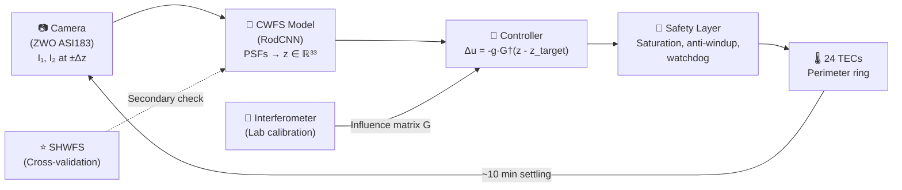

# LFAST On-Sky Closed-Loop CWFS + TEC Control — Implementation Plan

> **Date:** 2026-09-24  
> **System:** 0.76 m f/3.5 LFAST primary mirror, 24 perimeter TECs, curvature wavefront sensing  
> **Goal:** Reduce RMS wavefront error on-sky using neural CWFS → linear control → TEC correction  

---

## Architecture Summary



### Control Law

$$\mathbf{u}_{n+1} = \mathbf{u}_n - g \cdot G^\dagger \left(\mathbf{z}_n - \mathbf{z}_{\text{target}}\right)$$

where:
- $\mathbf{z}_n \in \mathbb{R}^{33}$: CWFS-estimated Zernike coefficients (Z4–Z36, metres OPD)
- $\mathbf{z}_{\text{target}} \in \mathbb{R}^{33}$: Target setpoint (absorbs model bias, optical offsets)
- $G \in \mathbb{R}^{33 \times 24}$: Interaction matrix (Zernike response per TEC)
- $G^\dagger \in \mathbb{R}^{24 \times 33}$: Regularised pseudoinverse (truncated SVD)
- $g \in (0, 1]$: Scalar integrator gain (stability margin)
- $\mathbf{u}_n \in \mathbb{R}^{24}$: TEC current commands, clamped to $[u_{\min}, u_{\max}]$

### Key Design Decisions (from interview)

| Decision | Choice | Rationale |
|:---|:---|:---|
| Control architecture | Modular: CWFS → Zernike → linear controller → TEC | Independently testable components |
| Sensing output | Absolute Zernike coefficients (Z4–Z36) | Model already trained for this |
| Target setpoint | $\mathbf{z}_{\text{target}}$ included | Absorbs model bias, optical offsets, fiber coupling optimum |
| Temporal dynamics | Snapshot sensing; settling-aware control | Standard active optics; no RNN/Kalman needed initially |
| Controllable modes | Sensed: all 33; controlled: subset from SVD of $G$ | 24 perimeter TECs likely correct ~8–15 modes |
| Validation | TEC-poke on-sky (primary), SHWFS cross-check (secondary) | Interferometric $G$ as ground truth for differential response |
| Domain transfer | Zero-shot first, then fine-tune stages 3–4 + head if needed | Assess gap before investing in fine-tuning |
| Array scaling | Single mirror first, per-mirror $G$, shared CWFS model | Manufacturing variability in TEC response |

---

## Phase 1: Interferometric TEC Characterisation (Lab, Offline)

> **Prerequisites:** Interferometric surface maps for each of 24 TECs at currents $[-1, -0.8, \ldots, 0.8, 1]$  
> **Location:** Local workstation (data transfer to HPC if needed for heavy computation)  
> **Duration estimate:** 1–2 weeks

### 1.1 Data Ingest & Organisation

- [ ] Transfer interferometric surface maps to a structured directory:
  ```
  mirror_control/data/interferometry/
  ├── tec_01/
  │   ├── current_-1.0.fits   # or .dat, .npy — whatever the interferometer exports
  │   ├── current_-0.8.fits
  │   ├── ...
  │   └── current_+1.0.fits
  ├── tec_02/
  │   └── ...
  └── tec_24/
  ```
- [ ] Write a data loader that reads surface maps into numpy arrays: `surface[tec_id, current_idx] → np.ndarray (H, W)` height map in metres or waves
- [ ] Verify: plot raw surface maps for a few TECs at different currents to sanity-check data quality

### 1.2 Zernike Decomposition of Influence Functions

- [ ] Define a Zernike basis on the interferometer pupil matching the CWFS model's basis (Noll ordering, Z1–Z36, same pupil geometry: OD=0.76m, ID=0.152m)
- [ ] For each TEC $k$ and current level $I_j$:
  - Subtract the baseline surface (current = 0): $\Delta S_{k,j} = S_{k,j} - S_{k,0}$
  - Fit Zernike coefficients: $\Delta\mathbf{z}_{k,j} = \text{ZernikeFit}(\Delta S_{k,j})$
- [ ] Store results: `influence_zernike[tec_id, current_idx, mode_idx]` → shape `(24, 11, 36)`

### 1.3 Linearity & Symmetry Analysis

- [ ] For each TEC $k$ and Zernike mode $j$, plot $\Delta z_{k,j}$ vs. TEC current $I$
- [ ] Assess **linearity**: fit a line $\Delta z_{k,j} = a_{k,j} \cdot I + b_{k,j}$; compute $R^2$ and residuals
- [ ] Assess **symmetry**: compare $f(+I)$ vs. $-f(-I)$ for each TEC; quantify asymmetry as $|\Delta z(+I) + \Delta z(-I)| / |\Delta z(+I)|$
- [ ] **Deliverable:** A diagnostic report:
  - Per-TEC linearity plot (all modes overlaid)
  - Symmetry residual histogram
  - Decision: is the linear model $\Delta\mathbf{z} = G \cdot \mathbf{u}$ adequate, or do we need a nonlinear model?

> [!IMPORTANT]
> If linearity is poor ($R^2 < 0.95$ for dominant modes), consider:
> - Piecewise-linear model with different gains for $I > 0$ and $I < 0$
> - Look-up table interpolation instead of matrix multiplication
> - Polynomial influence model: $\Delta z_{k,j} = a_{k,j} I + c_{k,j} I^2$

### 1.4 Build the Interaction Matrix $G$

- [ ] If linear: $G_{j,k} = a_{k,j}$ (slope from the linear fit in 1.3)
  - Resulting matrix: $G \in \mathbb{R}^{33 \times 24}$ (modes Z4–Z36 × 24 TECs)
- [ ] If piecewise-linear: build $G^+$ and $G^-$ for positive and negative current
- [ ] Verify: $G$ should have rank ≤ 24 (it maps 24 inputs to 33 outputs)

### 1.5 SVD Analysis & Controllability

- [ ] Compute SVD: $G = U \Sigma V^T$
- [ ] Plot singular values $\sigma_1 \geq \sigma_2 \geq \ldots \geq \sigma_{24}$
- [ ] **Identify controllable modes:** The columns of $U$ corresponding to non-negligible $\sigma_i$ define the controllable Zernike subspace. Expect ~8–15 well-conditioned modes.
- [ ] **Determine truncation rank $r$:** Choose $r$ such that $\sigma_r / \sigma_1 > \epsilon$ (e.g., $\epsilon = 0.01$). Modes $r+1 \ldots 24$ are poorly conditioned.
- [ ] **Build regularised pseudoinverse:**
  - Truncated SVD: $G^\dagger_r = V_r \Sigma_r^{-1} U_r^T$
  - Or Tikhonov: $G^\dagger_\alpha = (G^T G + \alpha I)^{-1} G^T$
- [ ] **Deliverable:** 
  - Singular value spectrum plot
  - Controllable mode table (which Zernike modes can be corrected, and to what precision)
  - Condition number of the truncated system

### 1.6 Simulated Closed-Loop Convergence

- [ ] Generate synthetic wavefront errors drawn from the same distribution as the training data ($\sigma = 125$ nm RMS, radial-order-weighted, Gaussian)
- [ ] Add simulated CWFS measurement noise (based on the model's known test WFE: ~30–35 nm RMS)
- [ ] Run the closed-loop simulator:
  ```python
  z_target = np.zeros(33)
  u = np.zeros(24)
  for iteration in range(50):
      z_measured = z_true + noise()           # CWFS measurement
      delta_u = -gain * G_pinv @ (z_measured - z_target)
      u = np.clip(u + delta_u, u_min, u_max)  # saturation
      z_true = z_initial + G @ u              # TEC response (instantaneous for sim)
      z_true += passive_drift(dt=10*60)       # optional: simulate thermal drift
  ```
- [ ] Sweep gain $g \in [0.1, 0.2, \ldots, 1.0]$ and plot convergence curves
- [ ] Test stability with measurement noise, model bias, and passive drift
- [ ] **Deliverable:** Optimal gain range, convergence rate, residual WFE floor

---

## Phase 2: CWFS Domain Adaptation & On-Sky Validation (Open-Loop)

> **Prerequisites:** Phase 1 complete (know which modes are controllable); telescope access with starlight  
> **Duration estimate:** 2–4 weeks (spread across observing nights)

### 2.1 Synthetic Training Data Augmentation

- [ ] **Defocus jitter:** Modify `make_training_data.py` to sample independent defocus offsets:
  ```python
  dz1 = delta_z + np.random.normal(0, sigma_dz)  # e.g., sigma_dz = 0.02 mm
  dz2 = -delta_z + np.random.normal(0, sigma_dz)
  ```
  Labels remain the true mirror Zernikes. The model learns robustness to mechanical positioning error.
- [ ] **Background noise:** Add uniform random background to each PSF frame before Roddier normalisation
- [ ] **Pupil registration jitter:** Apply small random translations ($\pm 2$ pixels) and rotations ($\pm 2°$) to both $I_1$ and $I_2$ images
- [ ] **Regenerate a subset** (e.g., 10,000 examples) with all augmentations enabled; verify that model performance doesn't degrade significantly on the original test set

### 2.2 Spider Vane Integration

- [ ] Measure or define the spider vane geometry (number of vanes, angular positions, widths)
- [ ] Add spider vane obscurations to the pupil model in `make_training_data.py`:
  ```python
  # After creating the circular aperture:
  for angle in spider_angles:
      vane_mask = make_spider_mask(pupil_grid, angle, width)
      aperture *= (1 - vane_mask)
  ```
- [ ] Generate a spider-vane dataset (~5,000–10,000 examples) with the canonical pupil orientation
- [ ] **Fine-tune stages 3–4 + MLP head** (freeze stem + stages 1–2):
  ```python
  # Freeze early layers
  for name, param in model.named_parameters():
      if 'stage1' in name or 'stage2' in name or 'stem' in name:
          param.requires_grad = False
  ```
  Use augmentation limited to the spider vane's actual symmetry group (e.g., 4-fold rotation if 4 vanes at 90°; no arbitrary reflections).
- [ ] Validate that fine-tuned model maintains performance on the symmetric test set while handling spider vane geometry

### 2.3 Canonical Pupil Orientation Definition

- [ ] Define the canonical coordinate system:
  - **Origin:** Pupil centre (central obscuration centre)
  - **+x axis:** Points toward TEC #1 (or a spider vane — pick a physical anchor)
  - **+y axis:** 90° counterclockwise from +x
  - **Parity:** Right-handed (no flip)
- [ ] Document this in a configuration file (`mirror_control/config/pupil_registration.yaml`)
- [ ] Determine the camera's image orientation relative to this coordinate system:
  - Is the image flipped left-right? Top-bottom? Rotated?
  - Apply the necessary transform to camera images before feeding to the model

### 2.4 Zero-Shot On-Sky Inference

- [ ] Point at a bright star ($m_V \lesssim 4$)
- [ ] Acquire $T = 8$ intra-focal frames, translate camera, acquire $T = 8$ extra-focal frames
- [ ] Run CWFS inference → $\mathbf{z}_{\text{CWFS}}$ (Z4–Z36)
- [ ] Simultaneously (or near-simultaneously) acquire SHWFS measurement → $\mathbf{z}_{\text{SHWFS}}$ (Z4–Z15)
- [ ] Compare: $\|\mathbf{z}_{\text{CWFS}} - \mathbf{z}_{\text{SHWFS}}\|$ for modes Z4–Z15
- [ ] **Deliverable:** Domain gap assessment report:
  - Mode-by-mode correlation between CWFS and SHWFS
  - Systematic bias (mean offset per mode)
  - Random scatter (std per mode)
  - Decision: is fine-tuning needed?

### 2.5 TEC-Poke On-Sky Validation

- [ ] At steady state, measure CWFS baseline: $\mathbf{z}_0$
- [ ] Apply a known TEC perturbation $\Delta\mathbf{u}$ (e.g., TEC #1 at +0.5)
- [ ] Wait ~10 min for settling
- [ ] Measure CWFS again: $\mathbf{z}_1$
- [ ] Also measure passive drift rate: take sequential CWFS measurements with no TEC changes over ~30 min
- [ ] Compare $\Delta\mathbf{z}_{\text{CWFS}} = \mathbf{z}_1 - \mathbf{z}_0$ vs. $\Delta\mathbf{z}_{\text{predicted}} = G \cdot \Delta\mathbf{u}$
- [ ] Repeat for 3–5 different TECs and current levels
- [ ] **Deliverable:** 
  - CWFS sensing fidelity vs. interferometric ground truth
  - $G$ consistency between lab and sky
  - Passive drift rate characterisation ($d\mathbf{z}/dt$ in nm/min for dominant modes)

### 2.6 Pupil Orientation Verification

- [ ] Perform the single-TEC poke test from 2.5
- [ ] Verify that the *direction* (sign and angular position) of the CWFS-detected change matches column $k$ of $G$
- [ ] If mismatched: determine the rotation/parity transform needed and apply to the camera preprocessing pipeline
- [ ] Lock in the orientation and document it

---

## Phase 3: Closed-Loop Integration & Commissioning (On-Sky)

> **Prerequisites:** Phase 2 complete (CWFS validated on-sky, $G$ validated between lab and sky, orientation locked)  
> **Duration estimate:** 3–6 observing nights

### 3.1 Control Loop Software Implementation

- [ ] Implement closed-loop controller in `mirror_control/`:
  ```
  mirror_control/
  ├── nn_WFS/                     # (submodule — CWFS model)
  ├── control/
  │   ├── interaction_matrix.py   # Load G, compute G†, SVD analysis
  │   ├── controller.py           # Integrator with gain, saturation, anti-windup
  │   ├── safety.py               # Watchdog, power limits, TEC current clamps
  │   └── loop.py                 # Main closed-loop orchestrator
  ├── hardware/
  │   ├── camera.py               # Camera acquisition interface
  │   └── tec_driver.py           # TEC command interface
  ├── config/
  │   ├── pupil_registration.yaml
  │   ├── control_params.yaml     # gain, saturation limits, z_target
  │   └── interaction_matrix.npy  # Pre-computed G†
  └── scripts/
      ├── run_closed_loop.py      # Main entry point
      ├── calibrate_orientation.py # TEC poke orientation check
      └── measure_drift.py        # Passive drift characterisation
  ```

### 3.2 Safety Layer Implementation

- [ ] **TEC current saturation:** Clamp each $u_k \in [u_{\min}, u_{\max}]$ (hardware limits from TEC specs)
- [ ] **Total power limit:** If $\sum_k P_k(u_k) > P_{\max}$, scale all commands proportionally
- [ ] **Anti-windup:** When a TEC is saturated, exclude it from the integrator accumulation:
  ```python
  delta_u = -gain * G_pinv @ (z - z_target)
  u_proposed = u + delta_u
  u_clamped = np.clip(u_proposed, u_min, u_max)
  u = u_clamped  # Don't accumulate the clipped excess
  ```
- [ ] **Watchdog:** If no CWFS measurement received within $T_{\text{timeout}}$ (e.g., 20 min), ramp all TECs to zero over 5 min

### 3.3 First Closed-Loop Attempt

- [ ] Start with very low gain: $g = 0.1$
- [ ] Set $\mathbf{z}_{\text{target}} = 0$ initially
- [ ] Run 5 iterations (~50 min total):
  - Measure CWFS → compute correction → apply TECs → wait 10 min → repeat
- [ ] Monitor: plot $\|\mathbf{z}_n\|_{\text{RMS}}$ vs. iteration number
- [ ] **Expected:** Slow but monotonic decrease in WFE
- [ ] If diverging: check sign convention, orientation, and gain

### 3.4 Gain Tuning

- [ ] Increase gain: $g = 0.2, 0.3, 0.5$
- [ ] For each gain, run 10 iterations and measure convergence rate
- [ ] **Optimal gain:** Fastest convergence without oscillation
- [ ] Expect optimal $g \approx 0.3$–$0.7$ depending on measurement noise and $G$ accuracy

### 3.5 Target Setpoint Calibration

- [ ] After achieving low WFE with $\mathbf{z}_{\text{target}} = 0$, optimise the target:
  - Measure fiber coupling efficiency at the converged state
  - Apply small offsets to $\mathbf{z}_{\text{target}}$ (one mode at a time) and measure coupling change
  - Find the $\mathbf{z}_{\text{target}}$ that maximises fiber coupling
- [ ] This absorbs any systematic bias in the CWFS model, corrector optics aberrations, or fiber alignment offsets

### 3.6 Performance Characterisation

- [ ] **Convergence:** Number of iterations to reach steady-state WFE
- [ ] **Residual WFE:** Steady-state RMS wavefront error (limited by: uncontrollable modes, CWFS noise, passive drift between iterations, $G$ inaccuracy)
- [ ] **Stability:** Run the loop for a full observing night (6+ hours, ~36 iterations); verify no divergence or drift
- [ ] **Rejection of passive disturbances:** Measure WFE with loop open vs. closed as the telescope tracks across the sky (changing gravity vector)

---

## Phase 4: Refinements & Scaling (Future)

> These are deferred until the basic system works. Prioritise based on what limits performance.

### 4.1 If Linearity Is Insufficient
- Implement piecewise-linear or polynomial $G(u)$
- Or: learn the forward model $\mathbf{z} = f(\mathbf{u})$ with a small neural network trained on interferometric data, and use its Jacobian as the local $G$

### 4.2 If Passive Drift Limits Performance
- Estimate drift rate from sequential CWFS measurements
- Implement predictive correction: $\Delta\mathbf{u}_{n+1} = -g \cdot G^\dagger \left(\mathbf{z}_n + \hat{\dot{\mathbf{z}}} \cdot \Delta t - \mathbf{z}_{\text{target}}\right)$
- Or: Kalman filter with state = (mirror figure, drift rate)

### 4.3 If CWFS Domain Gap Limits Performance
- Fine-tune with on-sky data using SHWFS labels (frozen backbone + stages 3–4 + head)
- Generate improved synthetic data with measured pupil geometry, measured seeing statistics, and measured background levels

### 4.4 If the Linear Controller Plateaus
- Consider reinforcement learning with the TEC commands as actions and WFE reduction as reward
- Model-based RL using the learned forward model from 4.1
- But only after exhausting the linear approach

### 4.5 Array Scaling
- Each mirror gets its own $G$ (measured during manufacturing acceptance)
- Shared CWFS model across all mirrors (same optics/camera)
- Per-mirror $\mathbf{z}_{\text{target}}$ calibration
- Parallel independent control loops (no cross-mirror coupling)

---

## Risk Register

| Risk | Impact | Mitigation | Status |
|:---|:---|:---|:---|
| TEC response is significantly nonlinear | Control matrix $G$ inaccurate → poor convergence | Piecewise-linear or polynomial model; analyse existing interferometric data first | **Phase 1.3 will resolve** |
| TEC response asymmetric (+I ≠ −I) | Same as above | Build separate $G^+$, $G^-$; or polynomial model | **Phase 1.3 will resolve** |
| $G$ differs between lab and sky | Controller applies wrong corrections | TEC-poke on-sky validation (Phase 2.5); measure $G$ at different tilt angles under interferometer | Open |
| CWFS domain gap too large | Model predictions meaningless on-sky | Zero-shot assessment (Phase 2.4); fine-tuning protocol ready (Phase 2.2) | Open |
| Passive drift faster than TEC settling | Loop can't converge — each correction is obsolete by the time it settles | Fans to reduce thermal gradients; drift-aware controller (Phase 4.2) | Open |
| Parity/rotation mismatch between CWFS and TECs | Controller drives WFE up instead of down | Canonical orientation definition + TEC-poke verification (Phase 2.3, 2.6) | Open |
| Defocus asymmetry biases Z4 prediction | Systematic WFE error in defocus | Defocus jitter augmentation (Phase 2.1); target setpoint absorbs bias | Open |
| Spider vane features degrade CWFS | Higher-order mode prediction errors | Spider-vane fine-tuning (Phase 2.2) | Open |
| Actuator saturation limits correction | Can't correct large aberrations in one step | Anti-windup + multi-iteration convergence; low gain prevents large single-step commands | Design complete |

---

## Summary: What Needs to Be Built

| Component | Location | Status | Phase |
|:---|:---|:---|:---|
| TEC influence analysis scripts | `mirror_control/analysis/` | **To build** | 1 |
| Interaction matrix $G$ & $G^\dagger$ | `mirror_control/config/` | **To build** | 1 |
| Closed-loop simulator | `mirror_control/analysis/` | **To build** | 1 |
| Defocus jitter augmentation | `nn_WFS/make_training_data.py` | **To build** | 2 |
| Spider vane pupil model | `nn_WFS/make_training_data.py` | **To build** | 2 |
| Partial fine-tuning (stages 3–4 + head) | `nn_WFS/train.py` | **To build** | 2 |
| Background/pupil registration augmentation | `nn_WFS/dataset.py` | **To build** | 2 |
| Pupil orientation config | `mirror_control/config/` | **To build** | 2 |
| On-sky inference pipeline (RODCNN-compatible) | `nn_WFS/evaluate.py` | **Fix existing** | 2 |
| Controller module | `mirror_control/control/` | **To build** | 3 |
| Safety layer | `mirror_control/control/` | **To build** | 3 |
| Closed-loop orchestrator | `mirror_control/scripts/` | **To build** | 3 |
