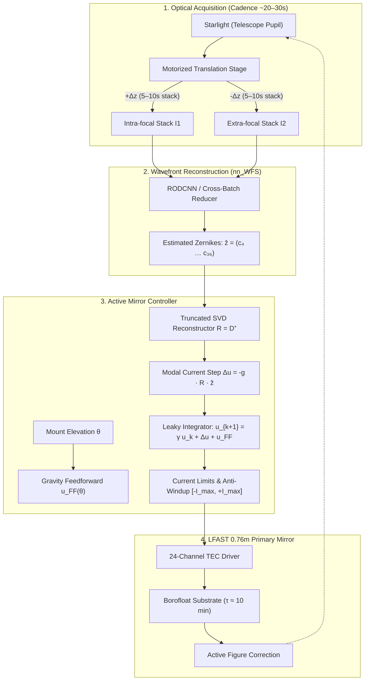

# On-Sky CWFS & Closed-Loop Active TEC Control Architecture

## Executive Summary

This document establishes the architecture and implementation roadmap for deploying Neural Curvature Wavefront Sensing (CWFS) on-sky to drive closed-loop figure correction of the LFAST 0.76m primary mirror using its perimeter ring of 24 thermoelectric controllers (TECs).

Following the core philosophy to **start simple and scale complexity only as required**, the system decouples optical wavefront sensing from thermomechanical mirror actuation. Optical sensing remains instantaneous and memoryless (reconstructing optical aberrations $Z_4$–$Z_{36}$ from seeing-averaged starlight exposures), while the slow 10-minute thermal settling time, ambient thermal drift, and gravity vector changes are managed entirely by an outer classical control loop using Singular Value Decomposition (SVD) modal pseudoinverse control with leaky integration and elevation feedforward.

---

## 1. System Architecture & Information Flow

---

## 2. Key Architectural Decisions (Resolutions from Interview)

### Decision 1: Decoupled 2-Stage Sensing vs. Control
* **Decision**: Keep the neural network strictly as an optical wavefront sensor (estimating standard Zernike coefficients $Z_4$–$Z_{36}$). All mirror thermomechanics, thermal diffusion lag, and actuator currents are handled in an independent classical controller.
* **Rationale**: Eliminates the catastrophic complexity of end-to-end learning (such as RL or direct current regression) which would require thousands of on-sky iterations at 10 minutes per step. Isolates optical physics (Fraunhofer propagation, seeing, detector noise) from solid mechanics (glass thermal diffusion, mounting stresses).

### Decision 2: Ground Truth Calibration & Domain Adaptation
* **Decision**: Bridge the sim-to-real gap using the uncharacterized 500x500 interferometer OPD dataset already collected across $[-I_{\max} \dots +I_{\max}]$. Extract the 24 true physical mirror modes and inject them into [`make_training_data.py`](file:///home/u7/warrenbfoster/git/nn_WFS/make_training_data.py) to train the CNN on realistic mirror deformations.
* **On-Sky Validation**: Use differential **ABBA push-pull modulation** ($\text{State } A \to B \to B \to A$) on-sky to cancel linear thermal drift and gravity tilt, leaving the calibrated $\Delta W_{\text{TEC}}$ as an unambiguous reference to validate on-sky inference accuracy.

### Decision 3: Empirical Actuator Sweep Characterization
* **Decision**: Process the raw 500x500 `.npy` dataset through an automated characterization pipeline to empirically determine:
  1. **Deflection Linearity ($R^2$)**: Quantify $\text{nm}/\text{A}$ response across the current span.
  2. **Polarity Symmetry**: Quantify the ratio of heating gain ($+I$, where Peltier and Joule heating $I^2R$ reinforce) vs. cooling gain ($-I$, where Joule heating opposes Peltier cooling).
  3. **Interaction Matrix $D \in \mathbb{R}^{33 \times 24}$**: Map the 24 actuator commands to Zernikes $Z_4$–$Z_{36}$.

### Decision 4: Time-Domain Separation & Acquisition Hardware
* **Hardware**: Motorized translation stage translating a single CMOS camera between $\pm \Delta z$.
* **Seeing Mitigation**: Because $I_1$ and $I_2$ are captured asynchronously (separated by translation travel time), exposures will be integrated/averaged over 5–15 seconds to smooth seeing speckles. The multi-frame cross-batch architecture in [`RODCNN`](file:///home/u7/warrenbfoster/git/nn_WFS/models/cnn_cwfs.py) will process these stacks.
* **Thermal Lag**: The 10-minute glass thermal settling time is handled strictly by the outer controller loop running at a sampling cadence of $\Delta t \approx 30\text{–}60\text{ s}$ with a loop gain $g \in [0.1, 0.3]$ and leak factor $\gamma \in [0.98, 1.0]$. The neural network remains memoryless.

### Decision 5: Closed-Loop Control Law
* **Decision**: Truncated Singular Value Decomposition (SVD) pseudoinverse:
  $$D = U \Sigma V^T \implies R = V \Sigma^{\dagger} U^T$$
* **Modal Filtering**: Truncate modes with singular values below a threshold $\sigma_i / \sigma_1 < \epsilon_{\text{cutoff}}$ (typically retaining ~10–16 well-conditioned modes such as astigmatism, trefoil, coma, and spherical). This prevents actuator saturation and high-frequency edge ripple.
* **Gravity Feedforward**: Open-loop table $u_{\text{FF}}(\theta)$ compensates elevation-dependent deformation, leaving the CWFS loop to correct dynamic thermal drift.

---

## 3. Implementation Roadmap

### Phase 1: Actuator Sweep Data Characterization (Once `.npy` files are transferred)
Create `nn_WFS/tools/characterize_actuators.py`:
- [ ] Load 500x500 `.npy` OPD maps for all 24 actuators across $[-I_{\max} \dots +I_{\max}]$.
- [ ] Mask circular aperture (76 cm OD, 15.2 cm ID) and subtract piston, tip, tilt ($Z_1, Z_2, Z_3$).
- [ ] Project each OPD map onto Zernikes $Z_4$–$Z_{36}$.
- [ ] Fit deflection vs. current curves per actuator to report linearity ($R^2$), gain ($\mu\text{m}/\text{A}$), and heating/cooling asymmetry ratio.
- [ ] Assemble and export the empirical Interaction Matrix $D \in \mathbb{R}^{33 \times 24}$ to `data/tec_interaction_matrix.h5`.

### Phase 2: Controller & Reconstructor Module
Create `nn_WFS/control/tec_controller.py`:
- [ ] Compute SVD: $D = U \Sigma V^T$.
- [ ] Implement condition-number-based singular value truncation and Tikhonov damping.
- [ ] Implement discrete leaky integrator with current clamping:
  $$u_{k+1} = \text{clip}\left(\gamma u_k - g R \hat{z}_k + u_{\text{FF}}(\theta), -I_{\max}, +I_{\max}\right)$$
- [ ] Include actuator asymmetry compensation (piecewise linear scalar mapping $g^{-1}(u)$) if Phase 1 reveals significant Joule heating disparity.

### Phase 3: Realistic Synthetic Training Data Injection
Update [`make_training_data.py`](file:///home/u7/warrenbfoster/git/nn_WFS/make_training_data.py):
- [ ] Add option to draw mirror phase screens as random linear combinations of the **empirical actuator influence functions** rather than purely abstract random Zernikes.
- [ ] Maintain the existing $D_4$ symmetry and detector noise injection pipeline.

### Phase 4: On-Sky Closed-Loop Integration & ABBA Protocol
Create `nn_WFS/scripts/run_onsky_loop.py` & `run_abba_validation.py`:
- [ ] Interface with the motorized translation stage and camera SDK to stream $I_1$ and $I_2$ stacks.
- [ ] Run inference via [`RODCNN`](file:///home/u7/warrenbfoster/git/nn_WFS/models/cnn_cwfs.py) checkpoint.
- [ ] Execute closed-loop active correction at 30–60 second intervals.
- [ ] Implement automated ABBA sequence for on-sky CWFS validation against calibrated mirror offsets.
